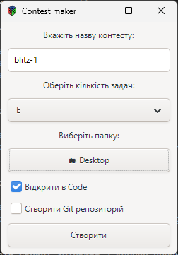

# 📦 Contest Maker

**Contest Maker** - це декстопна GTK-програма, яка допомагає швидко створити структуру контесту
Вона автоматизує створення директорій і вихідних файлів для задач. Додає базові шаблони

---

## UI прев'ю



---

## Install

### Linux

1. **Встанови залежності**
	
	На Ubuntu/Debian:

	```bash
	sudo apt update
	sudo apt install build-essential cmake ninja-build pkg-config libgtkmm-3.0-dev
	```

	На Fedora:

	```bash
	sudo dnf install cmake ninja-build gcc-c++ gtkmm30-devel
	```

	На Arch:

	```bash
	sudo pacman -S base-devel cmake ninja gtkmm3
	```

2. **Запусти скрипт збірки** з кореня проекту:

	```bash
	bash build.bash
	```

## 🛡 Ліцензія  
Цей проєкт ліцензовано під [MIT License](./LICENSE).

## ✨ Автор
**[@noinsts](https://github.com/noinsts)** – автор і розробник цього репозиторію.
