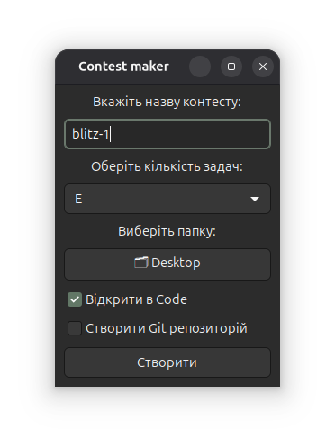

# 📦 Contest Maker

**Contest Maker** - простий десктопний GTK-додаток для швидкого старту під час контестів чи олімпіад.

## 🔥 Основні можливості

- Генерує структуру проекту в один клік.
- Автоматичне створення файлів для кожної задачі.
- Можливість автоматичного запуску проекту в **Visual Studio Code**.
- Вбудовані стартові шаблони коду для **Python**, **Java**, **C++**.
- Кросплатформеність.
- Можливість створення Git-репозиторію

## Прев'ю інтерфейсу



## 📂 Приклад структури проекту

```
ContestName/
├── README.md
├── CMakeLists.txt
└── src/
├── A/
│ ├── A.cpp
│ ├── A.java
│ └── A.py
├── B/
│ ├── B.cpp
│ ├── B.java
│ └── B.py
└── C/
├── C.cpp
├── C.java
└── C.py
```

## 📝 Шаблони коду

Для кожної мови вже є мінімальний **скелет рішення**. 

Треба тільки дописати свою логіку

### C++

```cpp
#include <bits/stdc++.h>
using namespace std;

void solve() {
    // TODO: code
}

int main() {
    ios_base::sync_with_stdio(false):
    cin.tie(nullptr);

    int tt; cin >> tt;

    while (tt--) {
        solve();
    }

    return 0;
}
```

### Java

```java
import java.io.*;

public class Name {
    private static void solve() {
        // TODO: code
    }

    public static void main(String[] args) throws IOException {
        try (BufferedReader sc = new BufferedReader(new InputStreamReader(System.in))) {
            int tt = Integer.parseInt(sc.readLine());

            while (tt-- > 0) {
                solve();
            }
        }
    }
}
```

### Python

```python
def main() -> None:
	pass

if __name__ == "__main__":
	main()
```

## ⚙️ Встановлення

### Linux

1. **Встанови залежності**
	
	На Ubuntu/Debian:

	```bash
	sudo apt update
	sudo apt install build-essential cmake ninja-build pkg-config libgtkmm-3.0-dev
	```

	На Fedora:

	```bash
	sudo dnf install cmake ninja-build gcc-c++ gtkmm30-devel
	```

	На Arch:

	```bash
	sudo pacman -S base-devel cmake ninja gtkmm3
	```

2. **Запусти скрипт збірки** з кореня проекту:

	```bash
	bash build.bash
	```

### Windows

1. **Встановлюємо [MSYS2](https://www.msys2.org/)**
2. **Оновлюємо пакети**

	```bash
	pacman -Syu
	```

3. **Встановлюємо інструменти та GTK:**

	```bash
	pacman -S mingw-w64-x86_64-toolchain \
          mingw-w64-x86_64-gtkmm3 \
          mingw-w64-x86_64-cmake \
          mingw-w64-x86_64-pkg-config
	```

4. **Запускаємо білд**

	```bash
	bash build.bash
	```


## 🛡 Ліцензія  
Цей проєкт ліцензовано під [MIT License](./LICENSE).

## ✨ Автор
**[@noinsts](https://github.com/noinsts)** – автор і розробник цього репозиторію.
